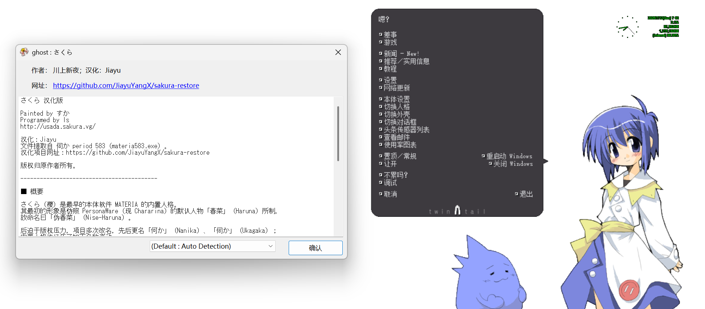

# さくら（御影樱）人格汉化

本仓库为伪春菜原基础软件 MATERIA 的内置人格 さくら（樱）的汉化工程。文本内容翻译由大模型辅助完成。

人格文件请见 [ghost](https://github.com/JiayuYangX/sakura-restore/tree/ghost) 分支。

## 安装方法

从 [Release](https://github.com/JiayuYangX/sakura-restore/releases) 中下载最新版本提供的 NAR 文件，拖入 SSP 进行安装。支持在线更新。

## 必要环境

- [SSP](https://ssp.shillest.net/)
- Windows（未开启「Beta 版: 使用 Unicode UTF-8 提供全球语言支持」选项）

## 汉化项目描述

文件提取自 [伺か period 583](http://usada.sakura.vg/contents/files/materia583.exe)。
原配布链接：<http://usada.sakura.vg/>

该人格的所有文本都被硬编码进 SHIORI（`first.dll`）中，其中绝大部分以明文形式存储。对话和菜单、提示文本位于 CODE 段，内置图形界面文本位于 rsrc 段。原来使用的 SJIS 编码文本在中文系统环境中运行会显示乱码，故直接将其替换为 GBK 译文（字节长度不超过原文）。

然而仍有如环境变量等少数文本以自定义压缩格式存储在 rsrc 段的 AITXT 中。由于无法获取其压缩/解压算法，本项目采用翻译器接口（`makoto.dll`，遵循 MAKOTO/2.0 协议）在 SHIORI 返回该部分文本后对其 SJIS 字节进行匹配替换。

由于仍采用硬编码形式，本汉化人格仅在中文系统环境下正常显示。

人格仍需依赖原来的 `materia.exe` 才能正常运行，故将其置于 `ghost/master` 目录之下。另外去除外壳和对话框图片的纯色背景，现在使用图片自身透明通道。时钟和提示框未经过 SSP 缩放，在现代屏幕 DPI 下可能显得过小。

## 翻译流程

1. 运行 `extract2csv.py` 和 `extract_aitxt.py` 提取日文原文
2. 运行 `replace_chars.py` 预处理不可编码字符 
3. 人工翻译 CSV 中的文本
4. 运行 `patch_dll.py` 打静态补丁
5. 运行 `build.bat` 生成带替换表的 `makoto.dll`
6. 部署后测试

## 编译环境

- MSYS2 + `mingw-w64-i686-gcc`（32 位 MinGW）
- Python 3.x