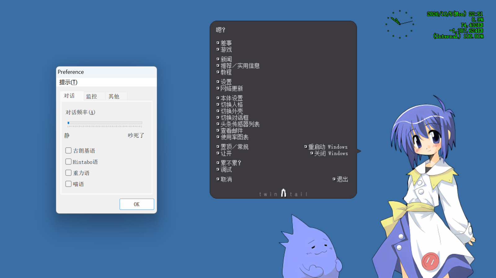

# さくら / 御影樱 人格汉化

本仓库为伪春菜原基础软件 [MATERIA](http://usada.sakura.vg/) 的内置人格 さくら 的汉化及修复工程。通过修补 DLL 文件，确保其在现代基础软件 [SSP](https://ssp.shillest.net/) 上能够正常运行，并优化多处细节。

人格文件请见 [ghost](https://github.com/JiayuYangX/sakura-restore/tree/ghost) 分支；
外壳图片处理见 [shell](https://github.com/JiayuYangX/sakura-restore/tree/shell) 分支。

## 安装方法

从 [Release](https://github.com/JiayuYangX/sakura-restore/releases) 中下载最新版本提供的 NAR 文件，拖入 SSP 进行安装。支持在线更新。

## 必要环境

- [SSP](https://ssp.shillest.net/)
- Windows（未开启「Beta 版: 使用 Unicode UTF-8 提供全球语言支持」选项）

## 人格介绍

さくら（樱）是第一个伪春菜人格（文件里称为 first）的正式名称，也是「伪春菜」这个名字最初指代的对象。现版使用的短发版形象通常被称为「御影樱」。其配角 うにゅう（乌纽）则是早期人格最常使用的配角形象。

人格修改自 2002 年 6 月 22 日「伺か」项目停止维护前的最后一次版本更新（period 583）。当时尚未形成后来成熟的通用 SHIORI + 辞书文件的形式，人格的所有功能都依靠担任 SHIORI 的 `first.dll` 实现。

## 项目描述

文件提取自 [伺か period 583](http://usada.sakura.vg/contents/files/materia583.exe)。

原配布链接：<http://usada.sakura.vg/>

### 汉化

该人格的所有文本都被硬编码进 `first.dll` 中，其中绝大部分以明文形式存储。对话和菜单、提示文本位于 code 节，内置窗体文本位于 rsrc 节，问答游戏的答案以反转形式存储。原来使用的 SJIS 编码文本在中文系统环境中运行会显示乱码，故直接将其替换为 GBK 译文（字节长度不超过原文）。

另有如环境变量等文本存于 rsrc 节的 AITXT 资源，以整块反转 + MT19937 密钥流异或的方式加密存储。早期曾用 `makoto.dll` 翻译器接口运行时替换，现直接将其译文重新加密后静态写回资源本体。详见 `docs/AITXT分析文档.md`。

### 图片修复

默认外壳和对话框现均改为使用图片自身透明通道。默认外壳图片使用 [Real-ESRGAN](https://github.com/xinntao/Real-ESRGAN) 的 realesrgan-x4plus-anime 模型进行四倍放大；再使用 [ImageMagick](https://imagemagick.org) 透明填充红色背景、边缘 2 像素勾线后再缩放回原大小，可形成平滑自然的半透明边缘。

### 兼容性及遗留问题修复

人格需依赖原来的 `materia.exe` 才能正常运行，故将其置于 `ghost/master` 目录之下。硬编码字符串由原本的 Shift-JIS / CP932 字符集变为 GBK / CP936，可能仅在中文系统环境下（未启用 UTF-8 Beta 设置）正常显示。

本项目通过关键字节替换和新增的 cave 节对 DLL 进行了多轮修补，使其在 SSP 运行时能还原本近乎全部的重要特性，同时还对本来的多项遗留问题进行了修复。修补内容具体如下：

#### 翻译和替换

- 字符串替换（code、rsrc、字体、问答游戏答案）
- AITXT替换
- DFM Font.Charset 替换为 GBK

#### SHIORI 兼容性修复

- NOTIFY 请求不再返回 400，避免状态机卡死
- 泡澡/小睡不再进入 InductionMode

#### 链接/锚点修复

- "海原雄山" 锚点补注册
- RSS 网页链接打开浏览器

#### 菜单逻辑修复

- 选择菜单、搜索输入框打开、视力检查进行时吞双击事件
- 进入 PassiveMode 后双击返回缓存菜单
- 输入框关闭时触发对应空输入
- 打字、问答游戏退出时关闭输入框、打字窗、视力窗、倒计时

#### 对话替换功能修复

- 打字游戏文本屏蔽替换
- 重力语修复：对话 + 窗口
  - 统一进行 `%` `[` `]` 保护（对话逻辑不全，窗口缺失）
  - 使用映射表模拟 SJIS 替换行为（仅同时存在于 GBK 中的字符）

#### 窗口修复

- 设置、Todo 退出崩溃修复
- SSP 下窗口键盘操作失效修复
- 窗口跟随 DPI 缩放 + 衍生问题修复：
  - 状态栏字体放大修复 + 重影修复
  - 退出时窗口尺寸保存放大修复 + 卸载时归还
  - 输入法修复（双门控 + 候选框位置、组字窗位置、组字窗字体大小）
  - 监控窗（模拟时钟和文字信息窗）非 100% 拖动掩码修复 + 跨 100% 刷新及显隐
  - 视力窗补 `Scaled=False` 属性